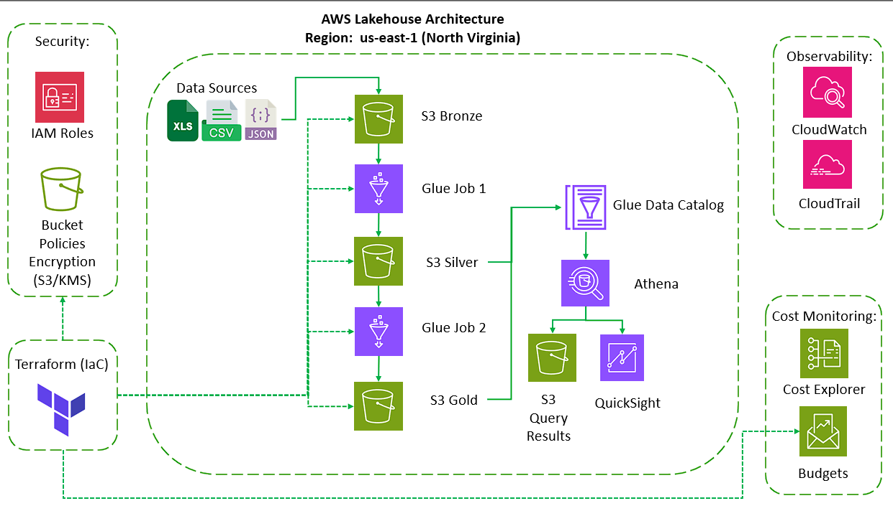

# AWS Serverless Lakehouse (HR Analytics Pipeline)

End-to-end serverless data pipeline built on AWS using a medallion-style architecture, designed for scalable processing, cost optimization, and analytics-ready outputs.

## Problem

Organizations often rely on fragmented HR datasets stored in spreadsheets, which leads to:

- manual processing
- limited data validation
- weak analytical capabilities

This project shows how that scenario can be transformed into a cloud-native lakehouse pipeline.

## Architecture



The PNG above is a high-level visual reference. The current implemented runtime flow is:

- `Landing -> Silver -> Gold -> BI Export -> Validate Catalog`

Current architecture notes:

- `landing` is the event-driven ingestion zone in `bronze/hr_attrition/landing/`
- there is no longer a separate operational `raw` promotion stage
- `gold_to_bi_export` produces a stable Parquet snapshot for local BI consumption
- Athena is kept in the active runtime for final catalog validation

For the authoritative written design, see [Architecture Overview](./docs/architecture/overview.md) and [Architecture Diagram](./docs/architecture/diagram.md).

## Dataset

This project uses the **IBM HR Analytics Employee Attrition & Performance** dataset, available on Kaggle:

https://www.kaggle.com/datasets/pavansubhasht/ibm-hr-analytics-attrition-dataset

Due to repository size and licensing considerations, the dataset is not included in this repository.

To run the pipeline locally, download the dataset from Kaggle and place it in the following path:

data/input/hr_attrition.csv

## How It Works

1. A new CSV file is uploaded to the landing prefix in S3.
2. EventBridge detects the object-created event.
3. Step Functions orchestrates the ETL workflow.
4. Glue runs the transformation stages:
   - `bronze_to_silver`
   - `silver_to_gold`
   - `gold_to_bi_export`
5. A stable Parquet BI snapshot is published for local visualization tools.
6. Athena validates the curated gold dataset.

## Tech Stack

- AWS S3
- AWS Glue
- AWS Glue Data Catalog
- AWS Step Functions
- AWS EventBridge
- AWS Athena
- Terraform
- Python
- Parquet
- Tableau / local BI snapshot workflow

## Key Design Decisions

- event-driven architecture using S3 + EventBridge
- schema control through contracts and explicit catalog metadata
- separation between infrastructure and ETL assets
- snapshot-based BI consumption instead of live managed BI as the active path
- cost optimization by keeping the demo serverless and lightweight

See [docs/adr](./docs/adr) for the detailed decision records.

## Deployment

Infrastructure is managed with Terraform.

```bash
terraform -chdir=infra init -backend=false
terraform -chdir=infra plan -var-file="env/dev.tfvars"
terraform -chdir=infra apply -var-file="env/dev.tfvars"
terraform -chdir=infra destroy -var-file="env/dev.tfvars"
```

Note: this project is designed for demo purposes. Resources can be destroyed after validation to avoid unnecessary cost.
The Terraform stack is intentionally configured for easy teardown, including recursive Athena workgroup cleanup and force-destroy S3 buckets. Use `destroy` carefully, especially outside `dev`.

---

## 8. Output / Results

Pending. This section is intentionally left for future completion once the final demo outputs are curated.

## Cost Optimization

- serverless architecture with pay-per-use services
- Parquet to reduce scan costs
- managed BI kept out of the active runtime path
- budget monitoring through AWS Budgets

## Future Improvements

- optional live BI integrations over Athena
- stronger CI/CD automation
- richer data quality monitoring
- broader production hardening
