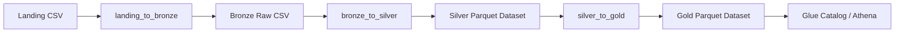
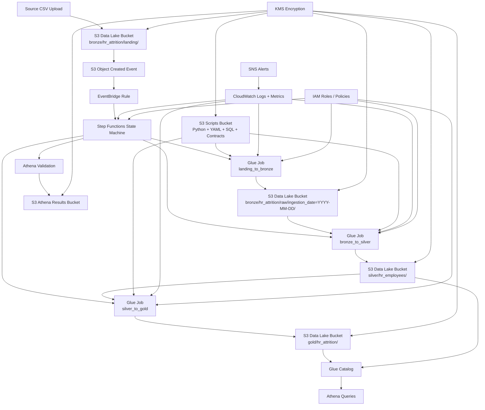
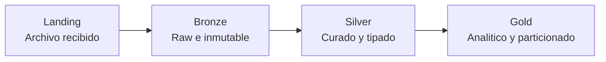
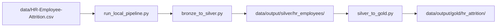
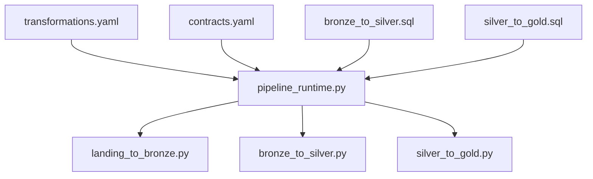

# ETL Architecture Diagram

## Objetivo

Este documento muestra el diagrama de la arquitectura actual del ETL, tanto en su flujo funcional como en los servicios AWS que lo soportan alrededor.

## 1. Flujo general del ETL

## 2. Arquitectura AWS actual

## 3. Detalle de las layers

- `Landing`: punto de entrada del archivo CSV.
- `Bronze`: conserva el raw por fecha de ingesta.
- `Silver`: limpia, tipa y normaliza la data.
- `Gold`: enriquece la data y la publica para analitica.

## 4. Diagrama de ejecucion local

## 5. Diagrama de assets y logica

Esto refleja la separacion de responsabilidades del proyecto:

- `YAML`: configuracion del pipeline
- `SQL`: logica de transformacion
- `Python`: ejecucion, validacion y materializacion

## 6. Resumen

La arquitectura actual del ETL combina:

- un flujo `medallion` claro
- ejecucion local con `DuckDB`
- ejecucion AWS modelada con `S3 + EventBridge + Step Functions + Glue`
- consumo analitico con `Glue Catalog + Athena`
- seguridad y observabilidad con `IAM + KMS + CloudWatch + SNS`

El diagrama representa la arquitectura objetivo actualmente implementada en codigo e IaC, aunque la validacion real en AWS sigue pendiente.
