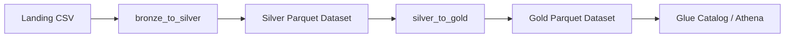
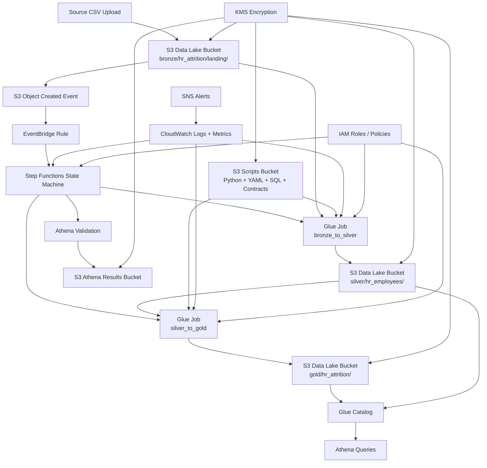
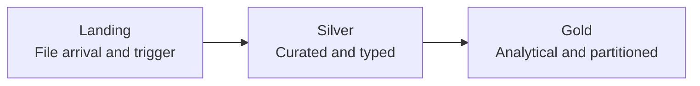
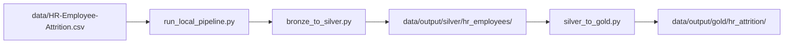
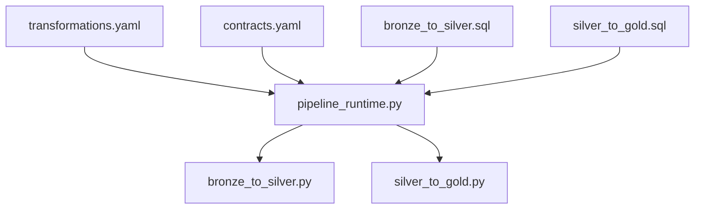

# ETL Architecture Diagram

## Objective

This document shows the current ETL architecture diagram, both as a functional flow and as the surrounding AWS services that support it.

## 1. General ETL Flow

## 2. Current AWS Architecture

## 3. Layer Detail

- `Landing`: entry point for the CSV file and pipeline trigger.
- `Silver`: cleans, types, and normalizes the data.
- `Gold`: enriches the data and publishes it for analytics.

## 4. Local Execution Diagram

## 5. Assets and Logic Diagram

This reflects the separation of responsibilities in the project:

- `YAML`: pipeline configuration
- `SQL`: transformation logic
- `Python`: execution, validation, and materialization

## 6. Summary

The current ETL architecture combines:

- a clear `medallion` flow
- local execution with `DuckDB`
- AWS execution modeled with `S3 + EventBridge + Step Functions + Glue`
- analytical consumption with `Glue Catalog + Athena`
- security and observability with `IAM + KMS + CloudWatch + SNS`

The diagram represents the target architecture currently implemented in code and IaC. The main AWS path has already been validated functionally, while deployment automation and broader operational hardening are still evolving.
